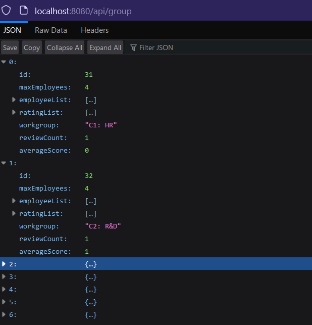

# Overview
This repository holds projects for the 'Application Programming' course at AGH University of Science and Technology, which I had during my fourth semester. 

During the course, we developed several applications using the Java programming language. 
Due to strict deadlines, these projects were my first experiences with the respective frameworks. 

All projects with the exception of the last one were made using IntelliJ IDEA. 
Used databases were created with phpMyAdmin tool included within XAMPP package. 
Following directories contain seperate projects.

## Lab1 and Lab2
Not particullary interesting programs, mostly Java basics.

## Employee Management System / Workplace Management System
A simple windowed app for managing employees and groups, made using JavaFX framework.

## EMS / WMS (JavaFX + Hibernate)
Slightly changed JavaFX application from before with addition of database communication using Hibernate. On top of that, new UI features have been implemented in order to accomodate the inclusion of the rating system.
SQL Database should also be included within the files.

## Springboot App
A simple back-end application in Springboot framework. Setting up many endpoints and utilizing extensive exception handling.
The database should be included within the files - depspite having the same name as in previous project, these databases are different and are not interchangeable.

With default settings all the endpoints should be under address http://localhost:8080/api. From which these split into 2 categories, below are the ones accessible through the browser:
- **Employee**:
  - *http://localhost:8080/api/employee/csv*: Returns a CSV file of employee data from the DB.
- **Group**:
  - *http://localhost:8080/api/group*: returns data about all the groups.
  - *http://localhost:8080/api/group/:32/employee*: Returns the list of employees for group of given ID.
  - *http://localhost:8080/api/group/:32/fill*: Return the precentage of spaces taken within the group of given ID.
 
Post and delete mapping were ommited in the list above. These are accesible through already written tests. All the endpoints can be found within EmployeeController, ClassEmployeeController and RateController java files. 

## Android Notepad App 
A simple notepad application made using Android Studio. 

Application's features include:
- Adding a note.
- Editing a note.
- Deleting the note.

The app consists of 3 views
- **Main activity**: Main screen is a list of exisitng notes, clicking on any note will open it's contents, with option to edit it. At the bottom there is a button to add a new note.
- **Add note activity**: In this screen the user is asked for note's name, pressing the button will open that note's contents.
- **View note activitty**: This activity allows user to inspect the note's contents, change these contents, change the title or delete the note.

<table align="center">
  <tr>
    <td></td>
    <td style="width: 20px;"></td>
    <td></td>
    <td style="width: 20px;"></td>
    <td></td>
  </tr>
</table>

The app stores data locally on user's phone. 
